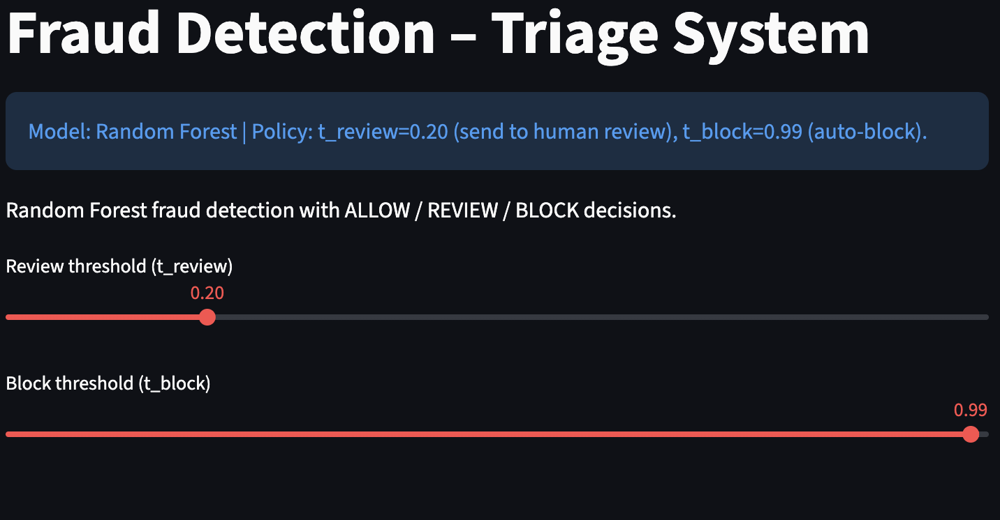
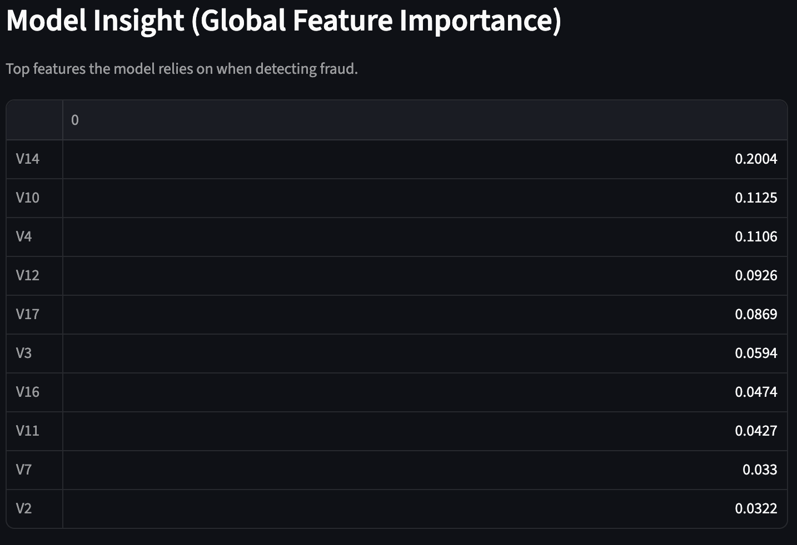
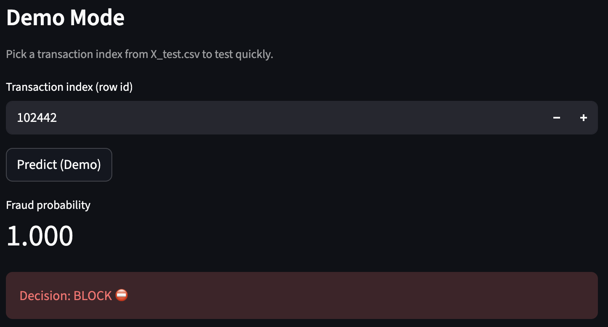
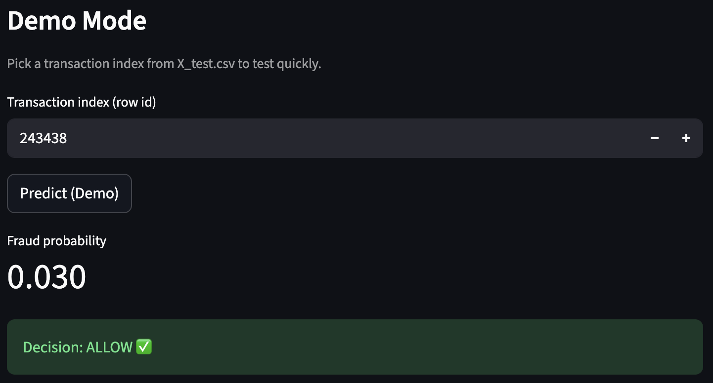
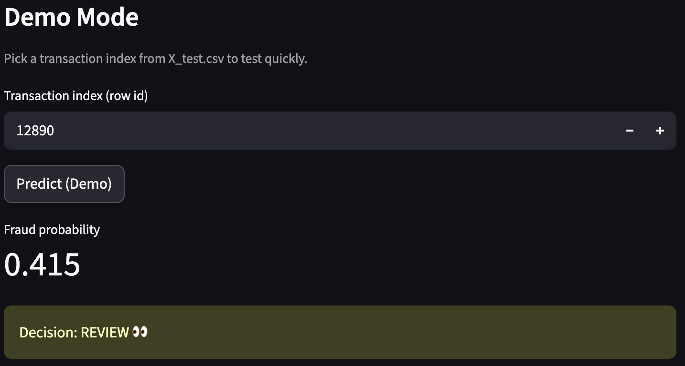

# Fraud Detection Decision-Support System

## Live Demo
🔗 https://fraud-detection-decision-system.streamlit.app

An end-to-end fraud detection decision-support system that outputs **ALLOW / REVIEW / BLOCK** based on predicted fraud risk.

Dataset used for model training: Credit Card Fraud Detection dataset (Kaggle, ULB).

🔗 https://www.kaggle.com/datasets/mlg-ulb/creditcardfraud/data

## Why Random Forest?

Handles non-linearity

Robust to feature scaling

Strong baseline for tabular fraud data

Interpretable via feature importance

## Overview
This project goes beyond binary fraud classification by implementing a triage-based decision system. Instead of labeling transactions as simply “fraud” or “normal”, the model outputs ALLOW, REVIEW, or BLOCK decisions based on calibrated probability thresholds. This design reflects real-world financial systems where uncertain cases are routed to human analysts to minimize harm to legitimate users.

## Screenshots

### Overview (Policy + thresholds)


### Global Feature Importance


### Example: BLOCK (high confidence fraud)


### Example: ALLOW (low risk transaction)


### Example: REVIEW (send to human review)


## What this is

Instead of only predicting fraud vs non-fraud, the system estimates a **fraud probability** and applies a triage policy:

- **ALLOW**: probability < t_review  
- **REVIEW**: t_review ≤ probability < t_block  
- **BLOCK**: probability ≥ t_block  

Default policy:
- t_review = 0.20
- t_block = 0.99

## Why it matters
Fraud detection is not just about accuracy. False positives can harm legitimate users, while false negatives can miss fraud. This project demonstrates risk-based decision making with a human-in-the-loop review stage.

## Explainability
- **Global**: Random Forest feature importance (top drivers of fraud risk)
- **Local**: shows key feature values for the chosen transaction/input

## Run locally

```bash
python3 -m streamlit run app.py

